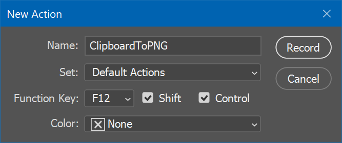

# ClipboardToPNG

Download: https://github.com/SilverEzhik/ClipboardToPNG/releases

This is a tiny helper utility for fixing an annoyance I have with Photoshop on Windows - the fact that it does not handle transparency. 

What this does is save the image as a .png file (located at `%TEMP%\clip.png`), and returns `0` if that successfully happened, and `1` if it didn't.

Using that, you can, for example, intercept `Ctrl`+`V` presses when Photoshop is open, and then if ClipboardToPNG returned 0, run a Photoshop action that would paste the temporary file, otherwise, perform a standard paste.

### Setting it up

1. Install [AutoHotKey](https://autohotkey.com/), then save this script into a .ahk file:

```ahk
DoPhotoshopPaste() {
    RunWait, %A_ScriptDir%\ClipboardToPNG.exe ; run utility, wait for it to complete
    if (ErrorLevel == 0) { ; if error code is 0
        SendEvent, +^{F12} ; press Shift+Ctrl+F12 to run the designated Photoshop action to paste
    }
    else { 
        SendEvent, ^v ; else, just perform a standard paste.
    }
}

#IfWinActive ahk_exe Photoshop.exe ; only activate this hotkey when photoshop is active
    ^v::DoPhotoshopPaste()
#IfWinActive
```

2. Save the ClipboardToPNG executable to the same directory as the script
3. Create a new Photoshop action, and assign `Shift`+`Ctrl`+`F12` as its shortcut:



4. Record the action: Go to `File` > `Place Embedded...`, open the file at `%TEMP%\clip.png`, and place it on your canvas (you may need to run ClipboardToPNG once with an image in your clipboard to make sure that an image file exists at that location). Optionally, you may also rasterize the layer, if you don't want the image to be pasted as a Smart Object.

Now, when you have the script running, whenever you press `Ctrl`+`V` when Photoshop is active and an image is in the clipboard, the image will be pasted with transparency.
